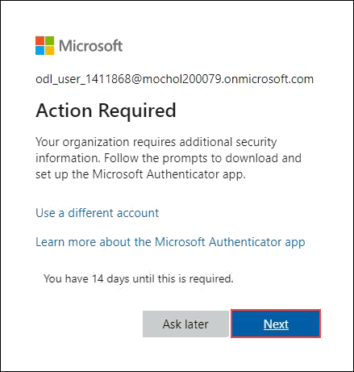
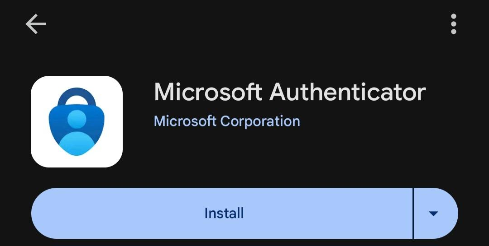

# Azure AI Foundry and Semantic Kernel Fundamentals

### Overall Estimated Duration: 4 Hours

## Overview

In this hands-on lab series, participants will explore the core capabilities of **Azure AI Foundry** and the **Semantic Kernel** framework to build intelligent, extensible AI applications. Designed for beginners in AI development, these labs guide participants through setting up AI projects in Azure AI Foundry, deploying the **GPT-4o** model, and connecting it seamlessly with Semantic Kernel to enable dynamic, prompt-based interactions.

Participants will learn to integrate **plugins** (e.g., time and weather utilities) to extend chatbot functionality, implement **Retrieval-Augmented Generation (RAG)** for more informed responses, and leverage **OpenAPI** to connect external services with minimal code. The labs also highlight responsible AI practices using **content filtering tools** in Foundry Studio and creative AI integration via **DALL·E** for image generation.

This series provides a foundational, hands-on experience with Semantic Kernel and Azure AI Foundry to help participants build scalable, AI-powered applications.

## Objective

**Explore how Azure AI Foundry and Semantic Kernel empower you to build intelligent, extensible, and responsible AI applications.**

By the end of this lab series, you'll be able to:

- **Azure AI Foundry Fundamentals**: Create, manage, and deploy AI projects using Azure AI Foundry and GPT-4o.
- **Semantic Kernel Fundamentals**: Build an intelligent chat experience by connecting Semantic Kernel with GPT-4o using a starter app.
- **Semantic Kernel Plugins**: Extend chatbot capabilities by building and integrating custom Semantic Kernel plugins.
- **Import Plugin using OpenAPI**: Integrate external APIs into Semantic Kernel using OpenAPI specifications.
- **Retrieval-Augmented Generation (RAG)**: Improve AI responses by combining knowledge retrieval with generative models.
- **Responsible AI**: Apply content filtering tools to build safer AI applications.
- **Image Generation using DALL·E**: Generate visuals from text prompts.
- **Multi-Agent Systems**: Coordinate multiple AI agents in Semantic Kernel to solve complex tasks.

## Prerequisites

- Basic knowledge of Azure
- Familiarity with AI concepts (language models, embeddings)
- Understanding of REST APIs and JSON
- Familiarity with Semantic Kernel (plugins, planners, skills)
- Basic resource management skills
- *(Optional)* OpenAPI knowledge for plugin integration
- *(Optional)* Understanding of RAG patterns

## Architecture

Participants will explore **Azure AI Foundry** and **Semantic Kernel** to build, deploy, and extend AI-powered applications. The journey begins with the **Azure Portal**, where participants manage AI services. They will deploy **GPT-4o** models via **Models + Endpoints** for real-time interactions.

Participants will also implement **RAG** using **Azure AI Search**, use **plugins** (e.g., Time & Weather), and integrate external services via **OpenAPI**. They'll explore **content filtering**, integrate **DALL·E** for creative tasks, and build foundational skills for scalable AI solutions.

## Architecture Diagram

## Explanation of Components

- **Azure AI Foundry**: Integrated environment for AI development and deployment.
- **Azure AI Studio**: Web-based UI for managing models and endpoints.
- **Models + Endpoints**: Deploy and manage GPT-4o for real-time AI interactions.
- **Semantic Kernel**: AI orchestration framework connecting LLMs, plugins, and APIs.
- **OpenAPI**: Integrate external APIs into AI workflows.
- **Azure AI Search**: Supports RAG by retrieving relevant data.
- **Azure Blob Storage**: Stores documents, datasets, and knowledge bases.
- **Azure AI Content Safety**: Tools for moderation and filtering.
- **Azure AI Vision Services**: Supports DALL·E image generation.
- **VS Code**: Development environment for coding and testing AI apps.
- **Python SDKs & REST APIs**: Used to interact with Azure AI services.

## Getting Started with the Lab

### Accessing Your Lab Environment

Once you're ready, your virtual machine and lab guide will be accessible via your web browser.

### Virtual Machine & Lab Guide

The virtual machine is your main environment. The lab guide is your roadmap.

### Exploring Your Lab Resources

Navigate to the **Environment** tab to view your lab resources and credentials.

### Split Window Feature

Open the lab guide in a separate window by clicking the **Split Window** button (top-right corner).

### Managing Your Virtual Machine

Start, stop, or restart your virtual machine from the **Resources** tab.

## Lab Validation

1. After completing a task, click **Validate** under the Validation tab.
2. If successful, move on to the next task.
3. If not, review the error message and retry.
4. For support, contact: **cloudlabs-support@spektrasystems.com**

## Let's Get Started with Azure Portal

1. On the VM, click the Azure Portal icon.

   .png)

2. Sign in to Microsoft Azure:
   - **Email/Username**: `<inject key="AzureAdUserEmail">`
   - **Password**: `<inject key="AzureAdUserPassword">`

   
   

3. If prompted with **Action Required**, click **Next**.

   

4. On the **Start by getting the app** page, click **Next** three times.
5. On your phone:
   - Install **Microsoft Authenticator** from the Play Store/App Store.
   - Open it and scan the **QR code** displayed.

   
   

6. Enter the verification code on the mobile app and tap **Yes**.
7. Click **Next**, then **Done**.

   

8. If prompted to stay signed in, choose **Yes**.
9. Tap **Finish** on your mobile device.
10. When logging in again, enter the code and tap **Yes** in the app.
11. If **Welcome to Microsoft Azure** appears, click **Cancel**.

### Navigating the Lab Guide

Use the **Previous** and **Next** buttons to navigate the lab guide.

.png)

This lab also introduces **Microsoft Copilot for Infrastructure Management**, helping optimize infrastructure responsibly and in compliance with best practices.

## Support Contact

The CloudLabs support team is available 24/7 via:

- 📧 Email: [cloudlabs-support@spektrasystems.com](mailto:cloudlabs-support@spektrasystems.com)
- 💬 Live Chat: [https://cloudlabs.ai/labs-support](https://cloudlabs.ai/labs-support)

Now, click **Next** to continue!

## Happy Learning!
