# **Exercise 1**: Azure AI Foundry Fundamentals

### Estimated Duration: 20 minutes

This hands-on lab provides experience with Azure AI Foundry and its core capabilities, including AI model deployment and integration with Azure AI Search. Designed for those new to the platform, the lab guides you step-by-step to set up an AI project, deploy a GPT-4o model, and configure essential AI services.

You will explore Azure AI Foundry to create and manage AI projects, use Models + Endpoints to deploy base models, and leverage Azure AI Search for scalable, efficient data retrieval. Ensure all prerequisites are met before starting, as the cloud-based Azure AI Foundry platform allows you to complete the lab remotely.

## Objectives

In this exercise, you will be performing the following tasks:
- Task 1: Set up Azure AI Foundry

## Task 1: Set up Azure AI Foundry

In this task, you will explore different flow types in Azure AI Foundry by creating a AI hub through Azure portal, then deploying the GPT-4o model, and testing its capabilities in the playground from the Azure AI Foundry.

1. On the **Azure portal** search bar, search for **AI Foundry (1)** and then select **Azure AI Foundry (2)** from the services.

    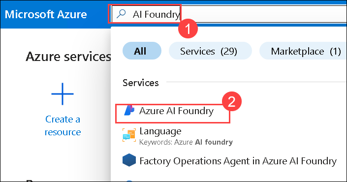

1. Expnad **Use with AI Foundry (1)**, select **AI Hubs (2)**, click on the **Create (3)** drop down and then select **Hub (4)**.

    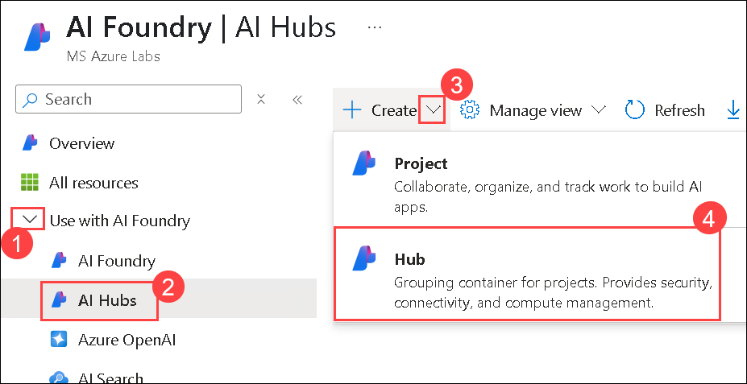

1. On the **Azure AI hub** page, provide the following details and then click on **Review+create (5)**:

    - **Subscription**: Leave the default one **(1)**
    - Resource group: Select **ai-foundry-<inject key="Deployment ID" enableCopy="false"></inject> (2)**
    - Region: **<inject key="Region" enableCopy="false"></inject> (3)**
    - Name: Enter **ai-foundry-hub-<inject key="Deployment ID" enableCopy="false"></inject> (4)**

      

1. Once the Validation passed, click on **Create**.

    

1. Once the deployment is completed, click on **Go to resource**.

    

1. Click on **Launch Azure AI Foundry**.

    

1. Select **Model + endpoints (1)**, then then click on **+ Deploy model (2)**, followed by **Deploy Base model (3)**.  

    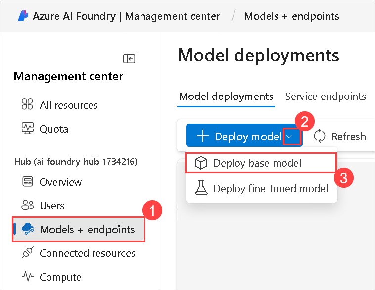

1. Search for **gpt-4o (1)**, select the **gpt-4o** model **(2)**, and click on **Confirm (3)**.

    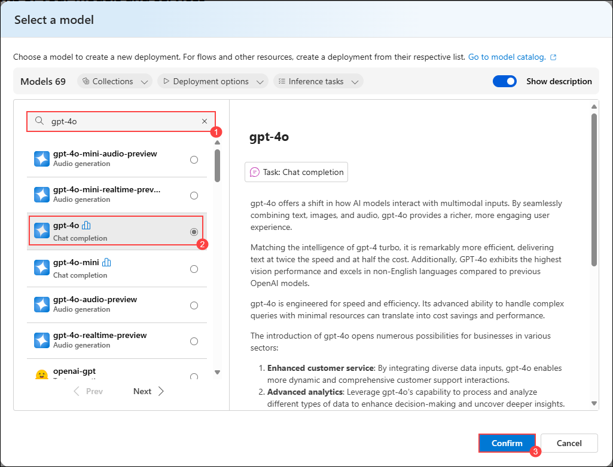

1. On the **Deploy model gpt-4o** blade, specify the following configuration options and click on **Deploy (4)**:

    - **Deployment type**: **Standard** (1)
    - **Model version**: 2024-05-13 (Default) (2)
    - **Tokens per Minute Rate Limit**: **50K** (3)

      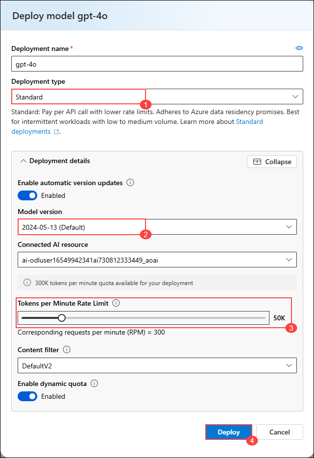 

1. Click on **Azure AI Foundry**.

    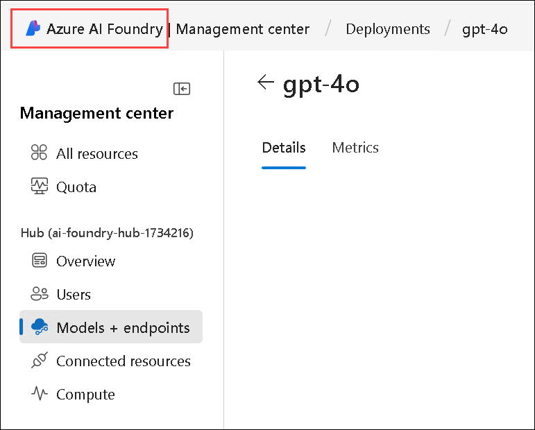

1. Select the **aifoundryhubxxxxxx** resource.

    

     >**Note**: **xxxxx** refers to randomly generated suffix.

1. Navigate to **Model + endpoints (1)**, then select **gpt-4o (2)** model and the click on **Open in Playground (3)**.

    

1. Replace the existing text with `Extract the United States Postal Service (USPS) formatted address from the following email` **(1)** then click on **Apply changes (2)**. Using this you can explore the capabilities of Azure OpenAI.

    

1. Click on **Continue**.

    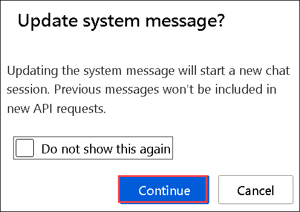

1. Provide the below mail in the chat **(1)** then click on **Send (2)** to identify and extract the postal address from the following email:
    ```
    Subject: Elevate Your Brand with Our Comprehensive Marketing Solutions!
    From: BrightEdge Marketing
    To: John Doe

    Dear John,
    At BrightEdge Marketing, we believe in the power of innovative marketing strategies to elevate brands and drive business success. Our team of experts is dedicated to helping you achieve your marketing goals through a comprehensive suite of services tailored to your unique needs.

    Please send letters to 123 Marketing Lane, Suite 400, in area 90210, Innovation City, California.

    Thank you for considering BrightEdge Marketing.
    Best regards,
    Sarah Thompson
    Marketing Director BrightEdge Marketing
    ```

    
    
1. You will receive a response similar to the one shown below:

    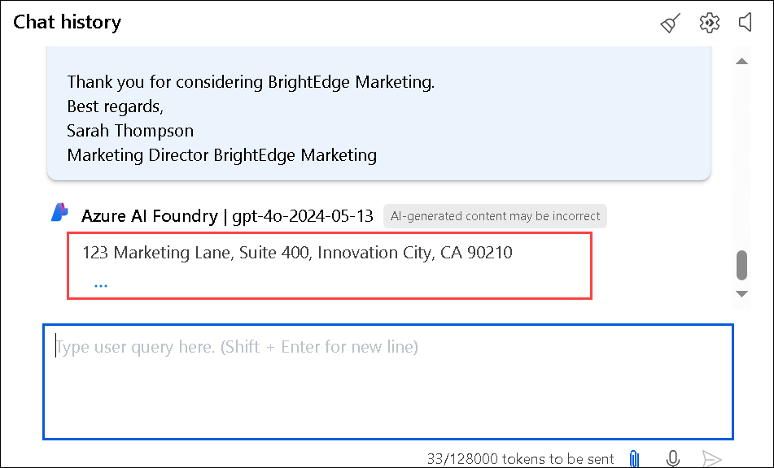

> **Congratulations** on completing the task! Now, it's time to validate it. Here are the steps:
 
- Hit the Validate button for the corresponding task. If you receive a success message, you can proceed to the next task. 
- If not, carefully read the error message and retry the step, following the instructions in the lab guide.
- If you need any assistance, please contact us at cloudlabs-support@spektrasystems.com. We are available 24/7 to help you out.

   <validation step="a3e77878-3ce2-4d69-b4e6-c88d4a0f45ec" />  

## Task 2: Create Azure AI Search

1. Navigate back to the **Azure portal**.

1. On the search bar, search for **AI Search (1)** then select **AI Search (2)** from the services.

    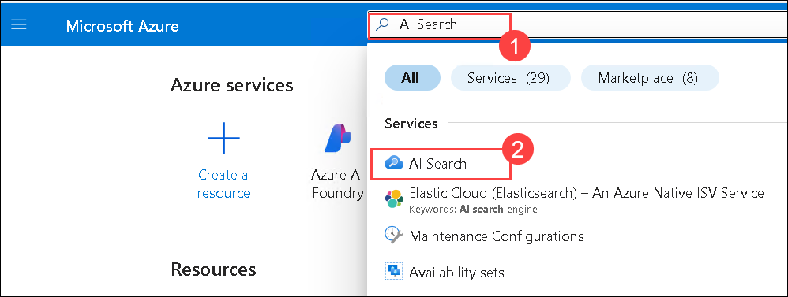

1. Select **AI Search (1)** then click on **+ Create (2)**.

    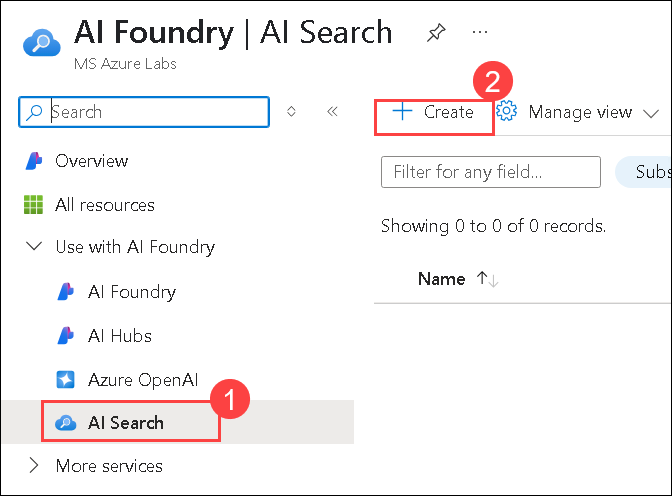

1. On the **Create a search service** page, provide the following details and then click on **Review+create (5)**:

    - Subscription: Leave the default one **(1)**
    - Resource group: Select **ai-foundry-<inject key="Deployment ID" enableCopy="false"></inject> (2)**
    - Service name: Enter **ai-search-<inject key="Deployment ID" enableCopy="false"></inject> (3)**
    - Region: **<inject key="Region" enableCopy="false"></inject> (4)** 

      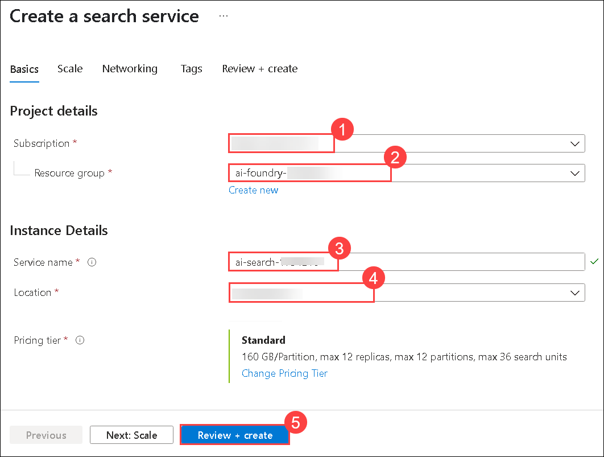

1. Click on **Create**.

    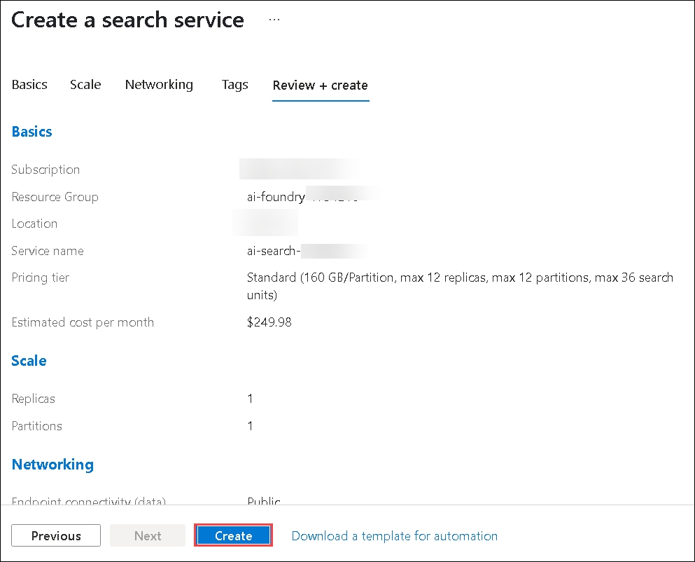

## Review

In this exercise, we utilized **Azure AI Foundry** to build and deploy AI solutions by accessing the Azure portal and interacting with GPT-4o models. We created an AI project, deployed a base model, and integrated Azure AI Search for enhanced data retrieval. Finally, we tested the model in the playground using a prompt to extract structured data from text. This enhanced our proficiency in deploying and interacting with AI models on the Azure platform.

You have successfully completed the below tasks for AI development using **Azure AI Foundry**:  

- Created an **AI project** and deployed a **GPT-4o** base model using **Models + Endpoints**.    
- Utilized **Semantic Kernel** to connect AI models with external APIs and plugins.

## Go to the next lab by clicking on the navigation.
