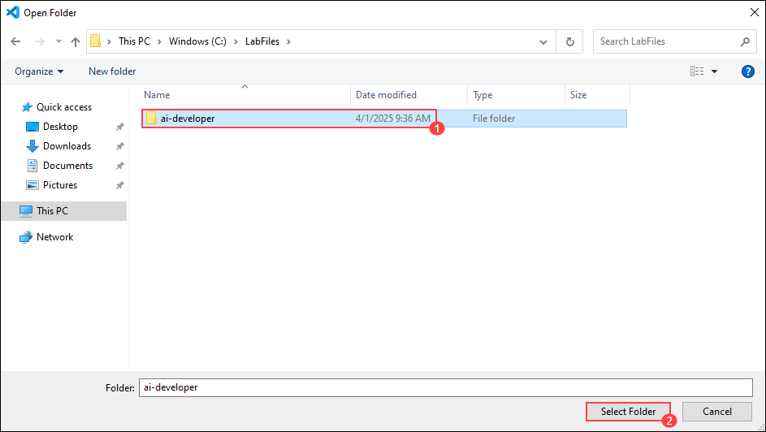
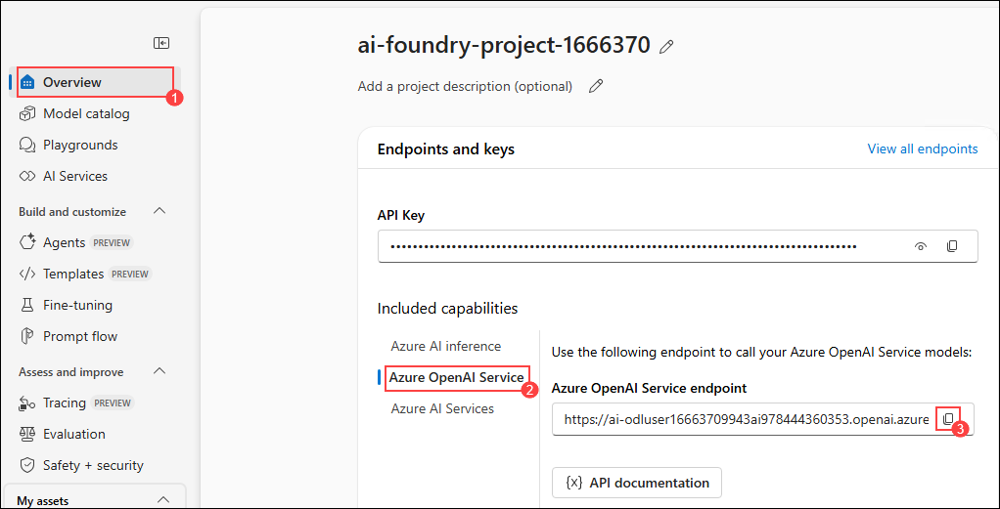
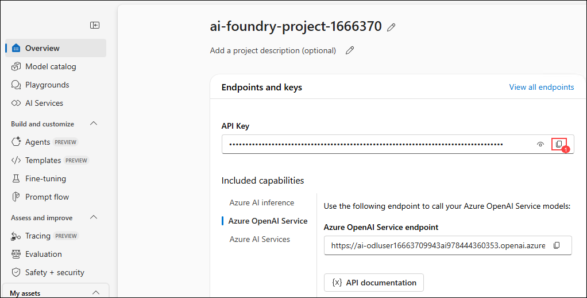
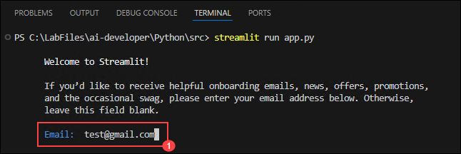
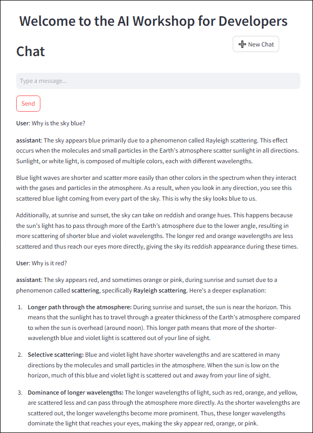
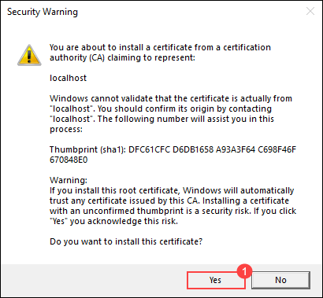

# **Exercise 2**: Semantic Kernel Fundamentals

### Estimated Duration: 25 minutes

This hands-on lab provides practical experience with Semantic Kernel and the Azure AI Foundry GPT-4o model. Designed for those new to AI development, the lab guides you step-by-step to build an intelligent chat feature within a starter application. You will use the Semantic Kernel framework to connect with the GPT-4o model, implement a chat API that sends user prompts, and return dynamic AI-generated responses.

## Objectives
In this exercise, you will be performing the following tasks:
- Task 1: Setup environment variables
- Task 2: Update the code files and run the app

## Task 1: Setup environment variables

In this task, you will explore different flow types in Azure AI Foundry by setting up Visual Studio Code, retrieving Azure OpenAI credentials, and configuring them in Python and C# environments.

1. Open **Visual Studio code** from the desktop shortcut in the labvm.
1. Click on **File (1)** and select **Open Folder (2)**.

    
1. Navigate to `C:\LabFiles` (1) and select **ai-developer (2)** folder and click on **Select Folder**.

    
1. If you receive `Do you trust the authors of the files in folder` warning, select the checkbox (1) and click on **Yes, I trust the authors (2)**.

    
1. Navigate to AI Foundry Portal and on **Overview (1)** page select **Azure OpenAI Service (2)** and **Copy (3)** the endpoint and paste it in **Notepad**, as it will be used in the upcoming exercises.

    
1. Copy the API key from AI Foundry Portal and paste it in **Notepad**, as it will be used in the upcoming exercises.

    

<details>
<summary><strong>Python</strong></summary>

1. Navigate to `Python>src` directory and open **.env** (1) file.

    
1. Paste **Azure OpenAI Service endpoint** copied earlier in the exercise besides `AZURE_OPENAI_ENDPOINT`.
    >Note:- Ensure that every value in the **.env** file is enclosed in **double quotes (")**.
1. Paste **API key** copied earlier in the exercise besides `AZURE_OPENAI_API_KEY`.

    
1. Save the file.

</details>

<details>
<summary><strong>C Sharp(C#)</strong></summary>

1. Navigate to `Dotnet>src>BlazorAI` directory and open **appsettings.json (1)** file.

    
1. Paste **Azure OpenAI Service endpoint** copied earlier in the exercise besides `AOI_ENDPOINT`.
    >**Note**:- Ensure that every value in the **appsettings.json** file is enclosed in **double quotes (")**.

    >**Note**:- Make sure to remove the "/" from the endpoint.
1. Paste **API key** copied earlier in the exercise besides `AOI_API_KEY`.

    
1. Save the file.

</details>

## Task 2: Update the code files and run the app

In this task, you will explore different flow types in Azure AI Foundry by updating code files, running the AI-powered app in Python and C#, and testing responses to user prompts.

<details>
<summary><strong>Python</strong></summary>

1. Navigate to `Python>src` directory and open **chat.py** file.

    
1. Add the following code in the `#Import Modules` (1) section of the file.
    ```
    from semantic_kernel.connectors.ai.chat_completion_client_base import ChatCompletionClientBase
    from semantic_kernel.connectors.ai.open_ai import OpenAIChatPromptExecutionSettings
    import os
    ```

    
1. Add the following code in the `# Challenge 02 - Chat Completion Service` (1) section of the file.
    ```
    chat_completion_service = AzureChatCompletion(
        deployment_name=os.getenv("AZURE_OPENAI_CHAT_DEPLOYMENT_NAME"),
        api_key=os.getenv("AZURE_OPENAI_API_KEY"),
        endpoint=os.getenv("AZURE_OPENAI_ENDPOINT"),
        service_id="chat-service",
    )
    kernel.add_service(chat_completion_service)
    execution_settings = kernel.get_prompt_execution_settings_from_service_id("chat-service")
    ```

    
1. Add the following code in the `# Start Challenge 02 - Sending a message to the chat completion service by invoking kernel` section of the file.
    ```
    global chat_history
    chat_history.add_user_message(user_input)
    chat_completion = kernel.get_service(type=ChatCompletionClientBase)
    execution_settings = kernel.get_prompt_execution_settings_from_service_id("chat-service")
    response = await chat_completion.get_chat_message_content(
        chat_history=chat_history,
        settings=execution_settings,
        kernel=kernel
    )
    chat_history.add_assistant_message(str(response))
    ```

    
1. Add the following code in the `#return result` section of the file.
    ```
    logger.info(f"Response: {response}")
    return response
    ```

    
1. In case you encounter any indentation error, use the code from the following URL:
    ```
    https://raw.githubusercontent.com/CloudLabsAI-Azure/ai-developer/refs/heads/prod/CodeBase/python/lab-02.py
    ```
1. Save the file.
1. Right click on `Python>src` in the left pane and select **Open in Integrated Terminal**.

    
1. Use the following command to run the app:
    ```
    streamlit run app.py
    ```
1. If you are asked for any email to register, feel free to use the below provided email, and hit **Enter**:
    ```
    test@gmail.com
    ```

    
1. If the app does not open automatically in the browser, you can access it using the following **URL**:

    ```
    http://localhost:8501
    ```
1. Submit the following prompt and see how the AI responds:
    ```
    Why is the sky blue?
    ```
    ```
    Why is it red?
    ```
1. You will receive a response similar to the one shown below:

    
</details>

<details>
<summary><strong>C Sharp(C#)</strong></summary>

1. Navigate to `Dotnet>src>BlazorAI>Components>Pages` directory and open **Chat.razor.cs (1)** file.

    
1. Add the following code in the `// Your code goes here(Line no. 92)` (1) section of the file.
    ```
    chatHistory.AddUserMessage(userMessage);
    var chatCompletionService = kernel.GetRequiredService<IChatCompletionService>();
    var assistantResponse = await chatCompletionService.GetChatMessageContentAsync(
        chatHistory: chatHistory,
        kernel: kernel);
    chatHistory.AddAssistantMessage(assistantResponse.Content);
    ```

    
1. In case you encounter any indentation error, use the code from the following URL: 
    ```
    https://raw.githubusercontent.com/CloudLabsAI-Azure/ai-developer/refs/heads/prod/CodeBase/c%23/lab-02.cs
    ```
1. Save the file.
1. Right click on `Dotnet>src>Aspire>Aspire.AppHost` in the left pane and select **Open in Integrated Terminal**.

    
1. Run the following line of code to trust the dev-certificates neccessary to run the app locally, and then select on **Yes**:
    ```
    dotnet dev-certs https --trust
    ```

    
1. Use the following command to run the app:
    ```
    dotnet run
    ```
1. Open a new tab in browser and navigate to the link for **blazor-aichat** i.e **https://localhost:7118/**.

    >**Note**: If you receive security warnings in the browser, close the browser and follow the link again.
1. Submit the following prompt and see how the AI responds:
    ```
    Why is the sky blue?
    ```
    ```
    Why is it red?
    ```
1. You will receive a response similar to the one shown below:

    
</details>

## Summary

In this exercise, we utilized **Semantic Kernel** in combination with the **Azure AI Foundry GPT-4o model** to build an intelligent chat feature within a starter application. We integrated the Semantic Kernel framework with GPT-4o, implemented a chat API to handle user prompts, and returned dynamic AI-generated responses. This enhanced our proficiency in connecting applications to powerful language models using modern AI development frameworks.