# Exercise 4: Import Plugin using OpenAPI

### Estimated Duration: 25 Minutes

This hands-on lab explores the integration of OpenAPI with Semantic Kernel to enhance AI-driven applications. Designed for developers new to API orchestration, the lab guides you through leveraging OpenAPI specifications to load external services as plugins dynamically. You will learn to import the provided WorkItems API as an OpenAPI plugin, enabling seamless interaction through AI-driven prompts. By the end of this lab, you will understand how OpenAPI simplifies API integration, reduces manual coding, and enhances the automation of external service calls.

## Objectives
In this exercise, you will be performing the following tasks:
- Task 1: Try the app without the OpenAPI Plugin
- Task 2: Create and import the OpenAPI Plugin

---

## Task 1: Try the app without the OpenAPI Plugin

In this task, you will explore different flow types in Azure AI Foundry by running the app without the OpenAPI Plugin to observe its default behavior.

1. Launch your AI Chat app in any of the languages, submit the following prompt, and see how it responds:
    ```
    What are my work items?
    ```
2. You will receive a response similar to the one shown below:

    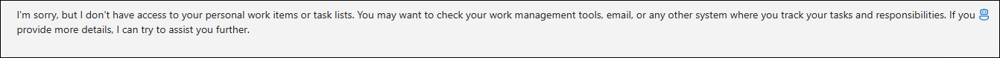

---

## Task 2: Create and import the OpenAPI Plugin

In this task, you will explore different flow types in Azure AI Foundry by creating and importing the OpenAPI Plugin to extend the app's capabilities.

<details>
<summary><strong>Python</strong></summary>

1. Right click on `Python>src>workitems` in the left pane and select **Open in Integrated Terminal (1)**.

    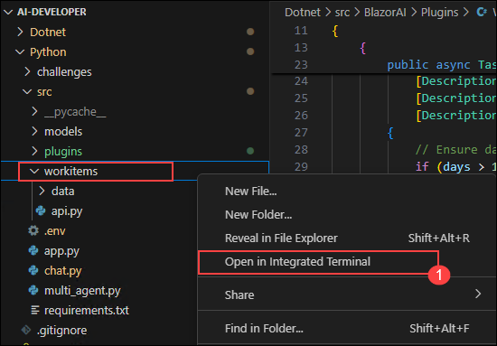

2. Use the following command to run the app:
    ```
    python api.py
    ```

3. ✅ **Important:**  
   Keep this terminal window open and running, as the application requires the active server process to serve the OpenAPI specification and endpoints.

4. You can find the OpenAPI spec at:  
   `http://127.0.0.1:8000/openapi.json`

    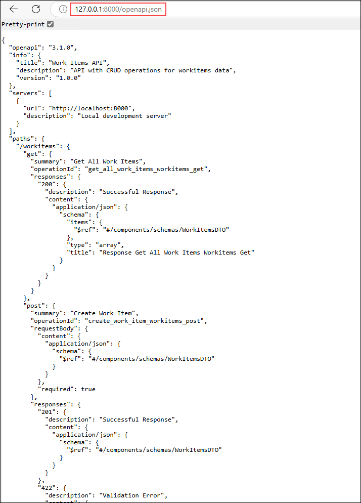

5. The Swagger page is available at:  
   `http://127.0.0.1:8000/docs`

    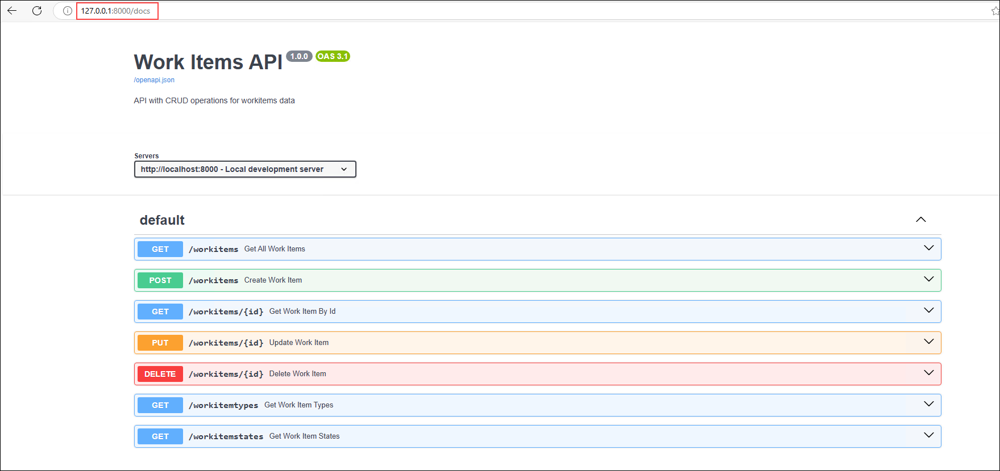

6. Navigate to `Python>src` directory and open **chat.py (1)** file.

    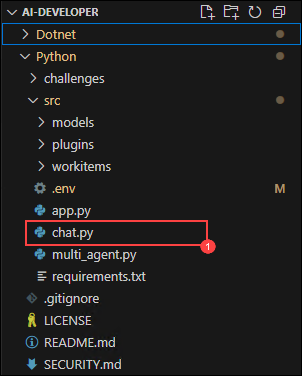

7. Add the following code in the `# Placeholder for OpenAPI plugin` section of the file:
    ```python
    kernel.add_plugin_from_openapi(
        plugin_name="get_tasks",
        openapi_document_path="http://127.0.0.1:8000/openapi.json",
        execution_settings=OpenAPIFunctionExecutionParameters(
            enable_payload_namespacing=True,
        )
    )
    ```

    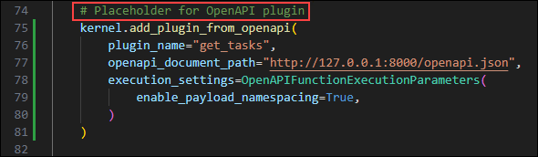

    > **Note:** Refer to the screenshots for the correct placement of the code to avoid indentation errors.

8. In case of indentation issues, use the reference code from:  
   `https://raw.githubusercontent.com/CloudLabsAI-Azure/ai-developer/refs/heads/prod/CodeBase/python/lab-04.py`

9. Save the file.

10. Right-click on `Python>src` again and select **Open in Integrated Terminal (2)**.

    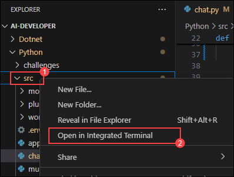

11. Run the app:
    ```
    streamlit run app.py
    ```

12. If it doesn't open automatically, access the app via:  
    `http://localhost:8501`

13. Submit this prompt to the AI:
    ```
    What are my work items?
    ```

14. You will receive a response similar to:

    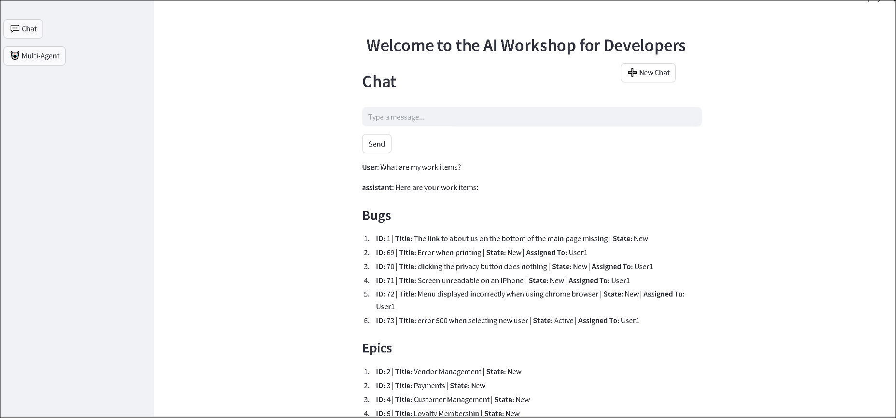

</details>

---

<details>
<summary><strong>C Sharp (C#)</strong></summary>

1. Right-click on `Dotnet>src>Aspire>Aspire.AppHost` and select **Open in Integrated Terminal (1)**.

    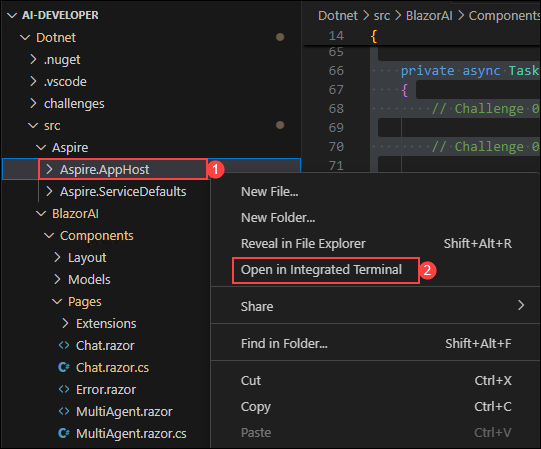

2. Run the app:
    ```
    dotnet run
    ```

3. ✅ **Important:**  
   Keep this terminal window open and running. The application needs the hosting service to be active to expose the API and UI endpoints.

4. OpenAPI spec is available at:  
   `http://localhost:5115/swagger/v1/swagger.json`

    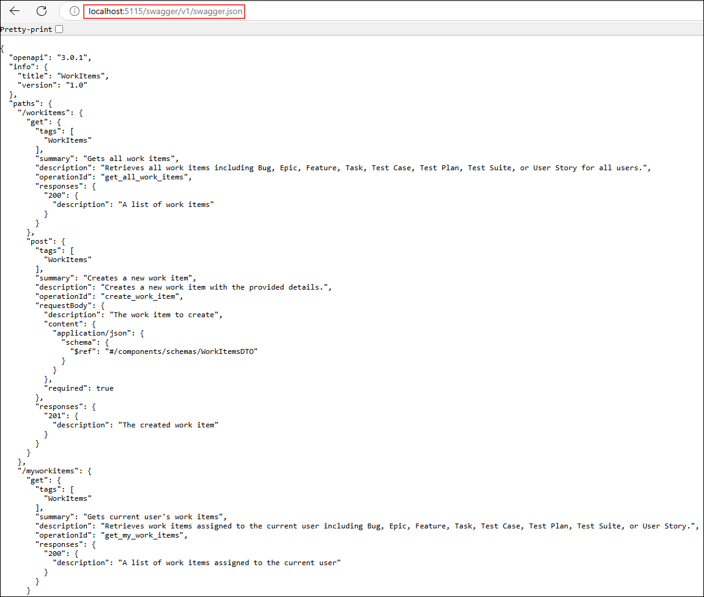

5. Swagger UI is available at:  
   `http://localhost:5115/swagger/index.html`

    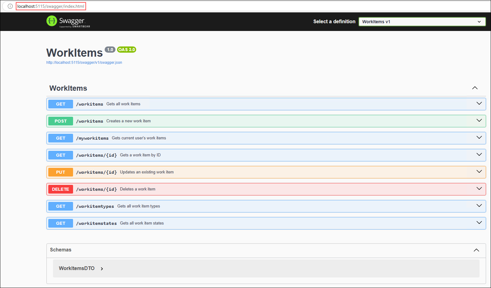

6. Navigate to `Dotnet>src>BlazorAI>Components>Pages` and open **Chat.razor.cs (1)**.

    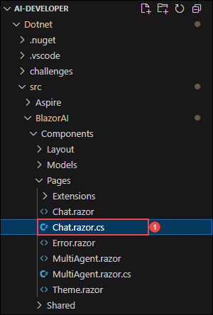

7. Add this line in the `// Import Models` section:
    ```csharp
    using Microsoft.SemanticKernel.Plugins.OpenApi;
    ```

    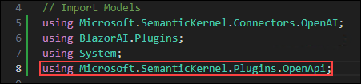

8. Add this in the `// Challenge 04 - Import OpenAPI Spec` section:
    ```csharp
    await kernel.ImportPluginFromOpenApiAsync(
        pluginName: "todo",
        uri: new Uri("http://localhost:5115/swagger/v1/swagger.json"),
        executionParameters: new OpenApiFunctionExecutionParameters()
        {
            EnablePayloadNamespacing = true
        }
    );
    ```

    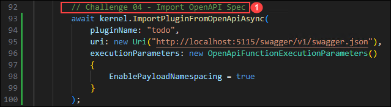

    > **Note:** Refer to the screenshots for the correct placement of the code to avoid syntax or indentation issues.

9. In case of issues, use the reference code from:  
   `https://raw.githubusercontent.com/CloudLabsAI-Azure/ai-developer/refs/heads/prod/CodeBase/c%23/lab-04.cs`

10. Save the file.

11. Right-click on `Dotnet>src>Aspire>Aspire.AppHost` again and select **Open in Integrated Terminal (2)**.

    

12. Run the app:
    ```
    dotnet run
    ```

13. Open browser and go to:  
    `https://localhost:7118/`

    > **Note:** If the browser shows a security warning, refresh or reopen the link to continue.

14. Submit this prompt to the AI:
    ```
    What are my work items?
    ```

15. You will receive a response similar to:

    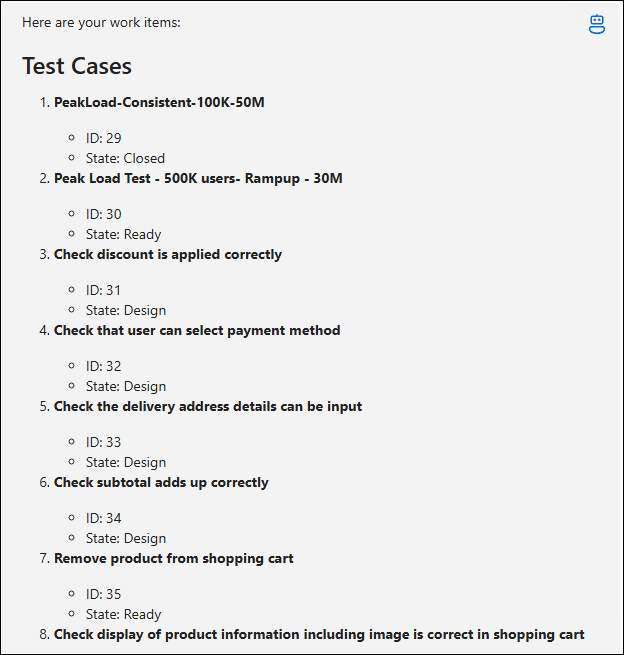

16. Press `Ctrl+C` in the terminal to stop the build process after completing your interaction.

</details>

---

## Review

In this exercise, we utilized **OpenAPI integration with Semantic Kernel** to enhance AI-driven applications through dynamic API orchestration. We imported the **WorkItems API** as an OpenAPI plugin, enabling seamless interaction with external services using AI-generated prompts. This enhanced our proficiency in simplifying API integration, reducing manual coding, and automating external service calls within intelligent applications.

We have successfully completed the below tasks for **OpenAPI integration with Semantic Kernel**:

- Integrated **OpenAPI with Semantic Kernel** to enable dynamic API orchestration.  
- Imported and configured the **WorkItems API** as an **OpenAPI plugin** for seamless external service interaction.

---

## ➡️ Proceed to the next lab using the navigation menu.

