# Exercise 5: Retrieval-Augmented Generation (RAG)

### Estimated Duration: 40 Minutes

This hands-on lab introduces you to the Retrieval-Augmented Generation (RAG) pattern—an AI architecture that enhances response quality by integrating relevant external knowledge into the generative process. Designed for those new to RAG, the lab guides you through how retrieval mechanisms work alongside generative models to deliver more accurate, informed, and context-aware outputs. You will also gain a clear understanding of data privacy and security prompts, completions, embeddings, and training data remaining fully isolated—they are not shared with other customers, OpenAI, Microsoft, or third parties, nor are they used to improve models automatically.

## Objectives
In this exercise, you will be performing the following tasks:
- Task 1: Deploy a Text Embedding model
- Task 2: Create a Semantic Search Plugin to query the AI Search Index

## Task 1: Deploy a Text Embedding model

In this task, you will explore different flow types in Azure AI Foundry by deploying a Text Embedding model to enable text representation and similarity analysis.

1. Navigate to the [Azure AI Foundry](https://ai.azure.com/) portal.
1. Click on **Models + endpoints (1)** under **My assets** in the left pane, then click on **+ Deploy model**, followed by **Deploy Base model (2)**.

    
1. Search for **text-embedding-ada-002**, select the model **(1)**, and click on **Confirm (2)**.

    

1. Click on **Deploy**.

1. Navigate back to **Models+endpoints (1)**, select **GPT-4o (2)**, and click on **Open in playground (3)**.

    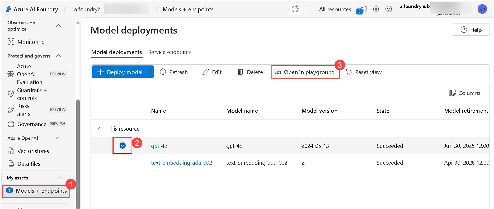

1. Click on **Add your data (1)** and select **+ Add a data source (2)**.

    

1. On the **Select or add data source**blade, provide the following details and then click on **Next (6)**:

    - Select **Upload files (Preview)** for `Data source`
    - Subscription: Leave the default one
    - Select Azure blob Azure Storage blob resouce: Select the storage account that starts with **aifoundryhubxxxxxx (1)**
    - Select Azure AI Search resource: Select **ai-search-<inject key="Deployment ID" enableCopy="false"></inject> (2)** 
    - Enter the index name: Enter **employeehandbook (3)** 
    - **Check the box** labeled Add vector search to enable this feature for the search resource **(4)**
    - Under Select an embedding model: choose **text-embedding-ada-002** **(5)** from the dropdown menu.
    - Click on **Next** **(6)**
 
      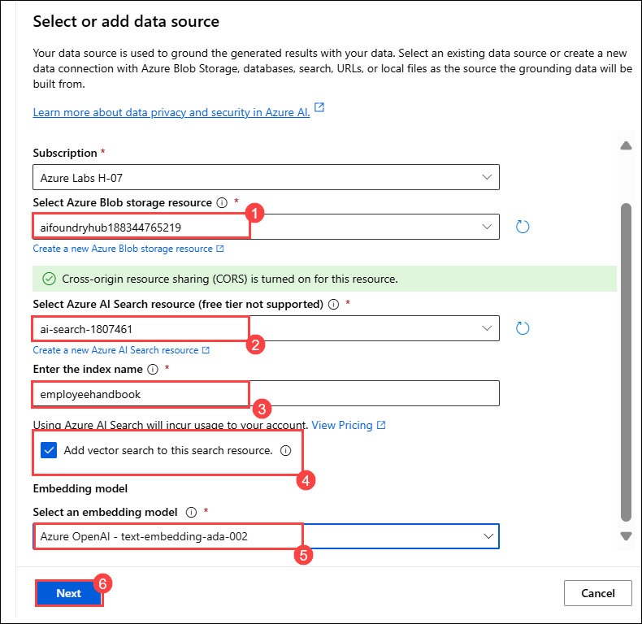

      >**Note:** If you receive a message prompting you to **Turn on CORS**, go ahead and click on it.

            

1. Click on **Browse for files**.

    
  
1. Navigate to `C:\LabFiles\ai-developer\Dotnet\src\BlazorAI\data\` and select **employee_handbook.pdf (1).** Click on **Open (2)**.

    

1. Click on **Upload files**.

    

1. Click on **Next**.

1. On the **Data Management** page, click on **Next**.

    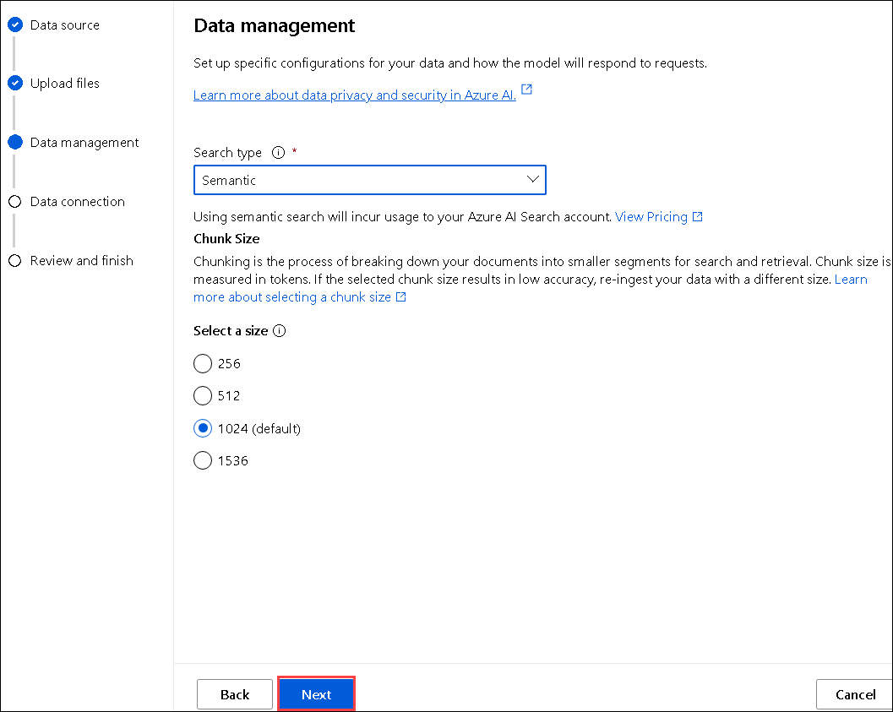

1. On the **Data Connection** blade, select **API Key (1)** for authenticatio and then click on **Next (2)**.    

    

1. Review the configuration and then click on **Save and close**.

    

1. The data injection might take around 5 minutes.

    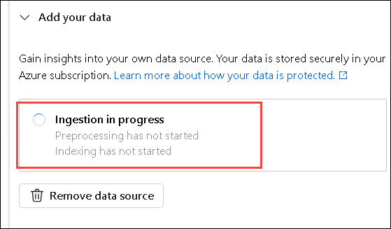

1. Navigate to the **Azure Portal** and search **AI Search (1).** Click on it and open the **AI Search (2)** resource located there.

    

1. Select **ai-search-<inject key="Deployment ID" enableCopy="false"></inject>**.    
    
    

1. On the **Overview (1)** page, copy the **URL (2)** and paste it into Notepad.

    

1. Navigate to **Keys (1)** under **Settings** in the left pane, copy the **Primary admin key (2)** from Azure Portal, and paste it into Notepad.

    


## Task 2: Create a Semantic Search Plugin to query the AI Search Index

In this task, you will explore different flow types in Azure AI Foundry by creating a Semantic Search Plugin to query the AI Search Index for enhanced retrieval capabilities.

<details>
<summary><strong>Python</strong></summary>

1. Navigate to `Python>src` directory and open **.env (1)** file.

    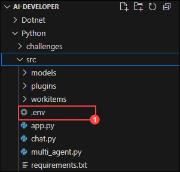

2. Paste the **AI search URL** that you copied earlier in the exercise beside `AI_SEARCH_URL` in the **.env** file.

    > **Note:** Ensure that every value in the **.env** file is enclosed in **double quotes (")**.

3. Paste the **Primary admin key** that you copied earlier in the exercise beside `AI_SEARCH_KEY`.

    

4. On the **Overview (1)** page, go to **Azure AI services (2)** and copy the **Azure AI services Endpoint (3)** and the Key as well.

    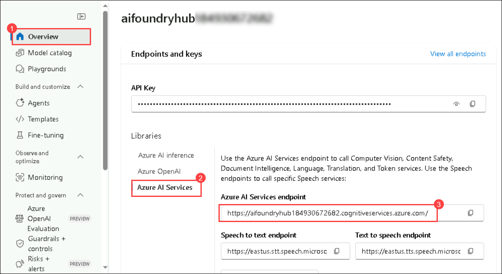

5. Paste the **Embed API key** you copied earlier into the .env file, next to the `AZURE_OPENAI_EMBED_API_KEY` entry.

6. Paste the **Embed Endpoint** you copied earlier into the .env file, next to the `AZURE_OPENAI_EMBED_ENDPOINT` entry.

    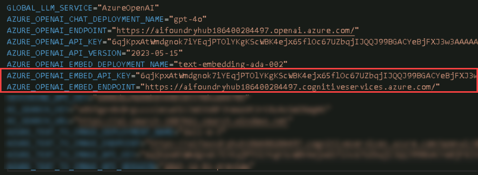

7. Save the file.

8. Navigate to `Python>src>plugins` directory and create a new file named **ContosoSearchPlugin.py (1)**.

    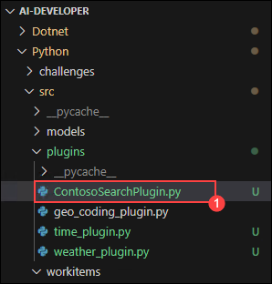

9. Add the following code to the file:

    ```python
    # Entire ContosoSearchPlugin class code goes here...
    # (Omitted for brevity, but should be placed within this code block)
    ```

10. Save the file.

11. Navigate to `Python>src` directory and open **chat.py (1)** file.

    

12. Add the following code in the `#Import Modules` section of the file.

    ```python
    from semantic_kernel.connectors.ai.chat_completion_client_base import ChatCompletionClientBase
    from semantic_kernel.connectors.ai.open_ai import OpenAIChatPromptExecutionSettings
    import os
    from semantic_kernel.connectors.ai.open_ai.prompt_execution_settings.azure_chat_prompt_execution_settings import (
        AzureChatPromptExecutionSettings,
    )
    from plugins.time_plugin import TimePlugin
    from plugins.geo_coding_plugin import GeoPlugin
    from plugins.weather_plugin import WeatherPlugin
    from semantic_kernel.connectors.ai.open_ai import AzureTextEmbedding
    from plugins.ContosoSearchPlugin import ContosoSearchPlugin
    ```
    
    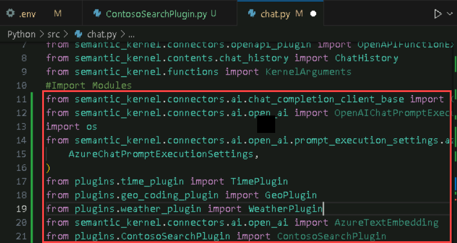

13. Add the following code in the `#Challenge 05 - Add Text Embedding service for semantic search` section of the file.

    ```python
    text_embedding_service = AzureTextEmbedding(
        deployment_name=os.getenv("AZURE_OPENAI_EMBED_DEPLOYMENT_NAME"),
        api_key=os.getenv("AZURE_OPENAI_API_KEY"),
        endpoint=os.getenv("AZURE_OPENAI_ENDPOINT"),
        service_id="embedding-service"
    )
    kernel.add_service(text_embedding_service)
    logger.info("Text Embedding service added")
    # Challenge 07 - Add DALL-E image generation service
    chat_completion_service = kernel.get_service(type=ChatCompletionClientBase)
    return kernel

    async def process_message(user_input):
        global chat_history

        # Check if the query is related to Contoso to route to the handbook search
        if is_contoso_related(user_input):
            logger.info(f"Contoso-related query detected: {user_input}")

            # For Contoso queries, we want fresh responses without previous context
            result = await search_employee_handbook(user_input)

            # Clear existing chat history for Contoso queries to avoid context contamination
            chat_history = ChatHistory()

            # Add only the current interaction
            chat_history.add_user_message(user_input)
            chat_history.add_assistant_message(result)
            return result

        kernel = initialize_kernel()
    ```
    
    

    > **Note**: Please refer to the screenshots to locate the code in the proper position to avoid indentation errors.

14. Add the following code in the `# Challenge 05 - Add Search Plugin` section of the file.

    ```python
    kernel.add_plugin(
        ContosoSearchPlugin(),
        plugin_name="ContosoSearch",
    )
    logger.info("Contoso Handbook Search plugin loaded")
    ```
    
    

    > **Note**: Please refer to the screenshots to locate the code in the proper position to avoid indentation errors.

15. Refer to the code provided at the following URL. Please verify that your code matches the one below and correct any indentation errors if present:

    - Open the provided link in your browser, press Ctrl + A to select all the content, then copy and paste it into Visual Studio Code.

    ```
    https://raw.githubusercontent.com/CloudLabsAI-Azure/ai-developer/refs/heads/prod/CodeBase/python/lab-05.py
    ```

16. Save the file.

17. Right-click on `Python>src` **(1)** in the left pane and select **Open in Integrated Terminal (2)**.

    

18. Use the following command to run the app:

    ```
    streamlit run app.py
    ```

19. If the app does not open automatically in the browser, you can access it using the following **URL**:

    ```
    http://localhost:8501
    ```

20. Submit the following prompts and observe the AI responses:

    ```
    What are the steps for the Contoso Performance Reviews?
    ```

    ```
    What is Contoso's policy on Data Security?
    ```

    ```
    Who do I contact at Contoso for questions regarding workplace safety?
    ```

21. You will receive a response similar to the one shown below:

      
      
    

</details>

<details>
<summary><strong>C Sharp(C#)</strong></summary>

1. Navigate to `Dotnet>src>BlazorAI` directory and open **appsettings.json (1)** file.

      

1. Paste the **AI search URL** that you copied earlier in the exercise besides `AI_SEARCH_URL` in **appsettings.json** file.

      > **Note:** Ensure that every value in the **appsettings.json** file is enclosed in **double quotes (")**.

1. Paste the **Primary admin key (1)** that you copied earlier in the exercise besides `AI_SEARCH_KEY` **(2)**.

      

1. Save the file.

1. Navigate to `Dotnet>src>BlazorAI>Plugins` directory and create a new file named **ContosoSearchPlugin.cs (1)**.

      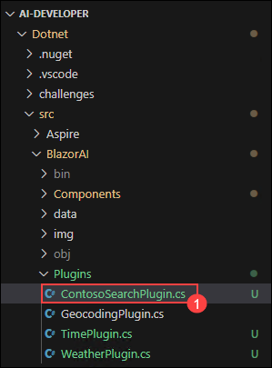

1. Add the following code to the file:

      ```
        using System.ComponentModel;
        using System.Text.Json.Serialization;
        using Azure;
        using Azure.Search.Documents;
        using Azure.Search.Documents.Indexes;
        using Azure.Search.Documents.Models;
        using Microsoft.SemanticKernel;
        using Microsoft.SemanticKernel.Embeddings;
        using System.Text;

        namespace BlazorAI.Plugins
        {
            public class ContosoSearchPlugin
            {
                private readonly ITextEmbeddingGenerationService _textEmbeddingGenerationService;
                private readonly SearchIndexClient _indexClient;

                public ContosoSearchPlugin(IConfiguration configuration)
                {
                    // Create the search index client
                    _indexClient = new SearchIndexClient(
                        new Uri(configuration["AI_SEARCH_URL"]),
                        new AzureKeyCredential(configuration["AI_SEARCH_KEY"]));

                    // Get the embedding service from the kernel
                    var kernelBuilder = Kernel.CreateBuilder();
                    kernelBuilder.AddAzureOpenAITextEmbeddingGeneration(
                        configuration["EMBEDDINGS_DEPLOYMODEL"],
                        configuration["AOI_ENDPOINT"],
                        configuration["AOI_API_KEY"]);
                    var kernel = kernelBuilder.Build();
                    _textEmbeddingGenerationService = kernel.GetRequiredService<ITextEmbeddingGenerationService>();
                }

                [KernelFunction("SearchHandbook")]
                [Description("Searches the Contoso employee handbook for information about company policies, benefits, procedures, or other employee-related questions. Use this when the user asks about company policies, employee benefits, work procedures, or any information that might be in an employee handbook.")]
                public async Task<string> Search(
                    [Description("The user's question about company policies, benefits, procedures or other handbook-related information")] string query)
                {
                    try
                    {
                        // Convert string query to vector embedding
                        ReadOnlyMemory<float> embedding = await _textEmbeddingGenerationService.GenerateEmbeddingAsync(query);

                        // Get client for search operations
                        SearchClient searchClient = _indexClient.GetSearchClient("employeehandbook");

                        // Configure request parameters
                        VectorizedQuery vectorQuery = new(embedding);
                        vectorQuery.Fields.Add("contentVector");  // The vector field in your index
                        vectorQuery.KNearestNeighborsCount = 3;   // Get top 3 matches

                        SearchOptions searchOptions = new()
                        {
                            VectorSearch = new() { Queries = { vectorQuery } },
                            Size = 3  // Return top 3 results
                        };

                        // Perform search request
                        Response<SearchResults<IndexSchema>> response = await searchClient.SearchAsync<IndexSchema>(searchOptions);

                        // Collect search results
                        StringBuilder results = new StringBuilder();
                        await foreach (SearchResult<IndexSchema> result in response.Value.GetResultsAsync())
                        {
                            if (!string.IsNullOrEmpty(result.Document.Content))
                            {
                                results.AppendLine($"Title: {result.Document.Title}");
                                results.AppendLine($"Content: {result.Document.Content}");
                                results.AppendLine();
                            }
                        }

                        return results.Length > 0 
                            ? results.ToString()
                            : "No relevant information found in the employee handbook.";
                    }
                    catch (Exception ex)
                    {
                        return $"Search error: {ex.Message}";
                    }
                }

                private sealed class IndexSchema
                {
                    [JsonPropertyName("content")]
                    public string Content { get; set; }

                    [JsonPropertyName("title")]
                    public string Title { get; set; }

                    [JsonPropertyName("url")]
                    public string Url { get; set; }
                }
            }
        }
      ```

1. Save the file.

1. Navigate to `Dotnet>src>BlazorAI>Components>Pages` directory and open **Chat.razor.cs (1)** file.

    

1. Add the following code in the `// Import Models` section of the file.

    ```
    using Microsoft.SemanticKernel.Connectors.AzureAISearch;
    using Azure;
    using Azure.Search.Documents.Indexes;
    using Microsoft.Extensions.DependencyInjection;
    ```

    

1. Add the following code in the `// Challenge 05 - Register Azure AI Foundry Text Embeddings Generation` section of the file.

    ```
    kernelBuilder.AddAzureOpenAITextEmbeddingGeneration(
        Configuration["EMBEDDINGS_DEPLOYMODEL"]!,
        Configuration["AOI_ENDPOINT"]!,
        Configuration["AOI_API_KEY"]!);
    ```

    

      > **Note**: Please refer the screenshots to locate the code in proper position that helps you to avoid indentation error.

1. Add the following code in the `// Challenge 05 - Register Search Index` section of the file.

    ```
    kernelBuilder.Services.AddSingleton<SearchIndexClient>(sp => 
        new SearchIndexClient(
            new Uri(Configuration["AI_SEARCH_URL"]!), 
            new AzureKeyCredential(Configuration["AI_SEARCH_KEY"]!)
        )
    );
    
    kernelBuilder.Services.AddSingleton<AzureAISearchVectorStoreRecordCollection<Dictionary<string, object>>>(sp =>
    {
        var searchIndexClient = sp.GetRequiredService<SearchIndexClient>();
        return new AzureAISearchVectorStoreRecordCollection<Dictionary<string, object>>(
            searchIndexClient,
            "employeehandbook"
        );
    });
    
    kernelBuilder.AddAzureAISearchVectorStore();
    ```

      

> **Note**: Please refer the screenshots to locate the code in proper position that helps you to avoid indentation error.

1. Add the following code in the `// Challenge 05 - Add Search Plugin` section of the file.

    ```
    var searchPlugin = new ContosoSearchPlugin(Configuration);
    kernel.ImportPluginFromObject(searchPlugin, "HandbookPlugin");
    ```

      

1. Refer to the code provided at the following URL. Please verify that your code matches the one below and correct any indentation errors if present

    - Open the provided link in your browser, press Ctrl + A to select all the content, then copy and paste it into Visual Studio Code

         ```
         https://raw.githubusercontent.com/CloudLabsAI-Azure/ai-developer/refs/heads/prod/CodeBase/c%23/lab-05.cs
         ```
1. Save the file.

1. Right-click on `Dotnet>src>Aspire>Aspire.AppHost` **(1)** in the left pane and select **Open in Integrated Terminal (2)**.

      

1. Use the following command to run the app:

     ```
     dotnet run
     ```

1. Open a new tab in the browser and navigate to the link for **blazor-aichat**, i.e. **https://localhost:7118/**.

1. Submit the following prompt and see how the AI responds:

     ```
     What are the steps for the Contoso Performance Reviews?
     ```
     ```
     What is Contoso's policy on Data Security?
     ```
     ```
     Who do I contact at Contoso for questions regarding workplace safety?
     ```

1. You will receive a response similar to the one shown below:

      

      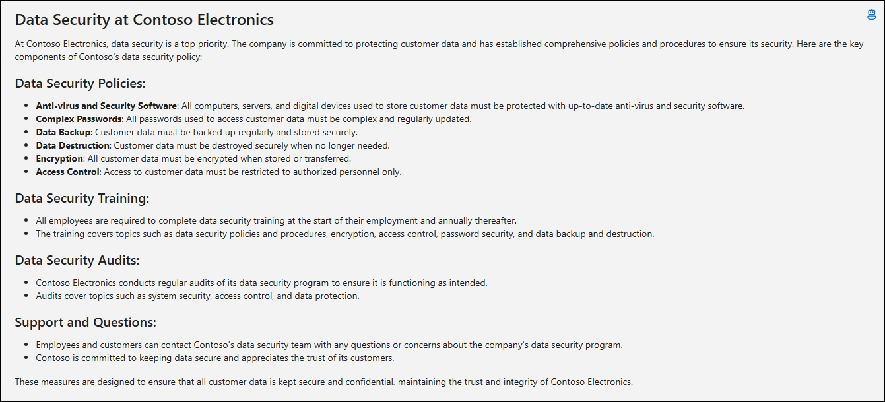

      

1. Once you receive the response, navigate back to the Visual Studio Code terminal and then press **Ctrl+C** to stop the build process.

</details>

> **Congratulations** on completing the task! Now, it's time to validate it. Here are the steps:
> - Hit the Validate button for the corresponding task.
> - If you receive a success message, you can proceed to the next task.
> - If not, carefully read the error message and retry the step, following the instructions in the lab guide. 
> - If you need any assistance, please contact us at cloudlabs-support@spektrasystems.com. We are available 24/7 to help you out.

<validation step="3497b745-b26b-47e6-bfbf-fdb7f238faa4" />  


## Review

In this exercise, we explored the **Retrieval-Augmented Generation (RAG) pattern** to enhance AI responses by integrating external knowledge into the generative process. We examined how retrieval mechanisms work alongside generative models to produce accurate, context-aware outputs. This enhanced our proficiency in building secure, knowledge-enriched AI solutions using the RAG architecture.

You have successfully completed the below tasks for **Retrieval-Augmented Generation (RAG) implementation**:  

- Integrated the **RAG pattern** to enhance AI-generated responses with external knowledge retrieval.  
- Utilized **Azure AI Search** to fetch relevant contextual data for more accurate outputs.  
- Configured **Semantic Kernel** to orchestrate retrieval and generative workflows seamlessly.  

### Congratulations on successfully completing the lab! Click Next >> to continue to the next lab.
