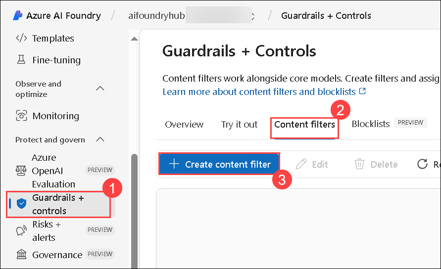
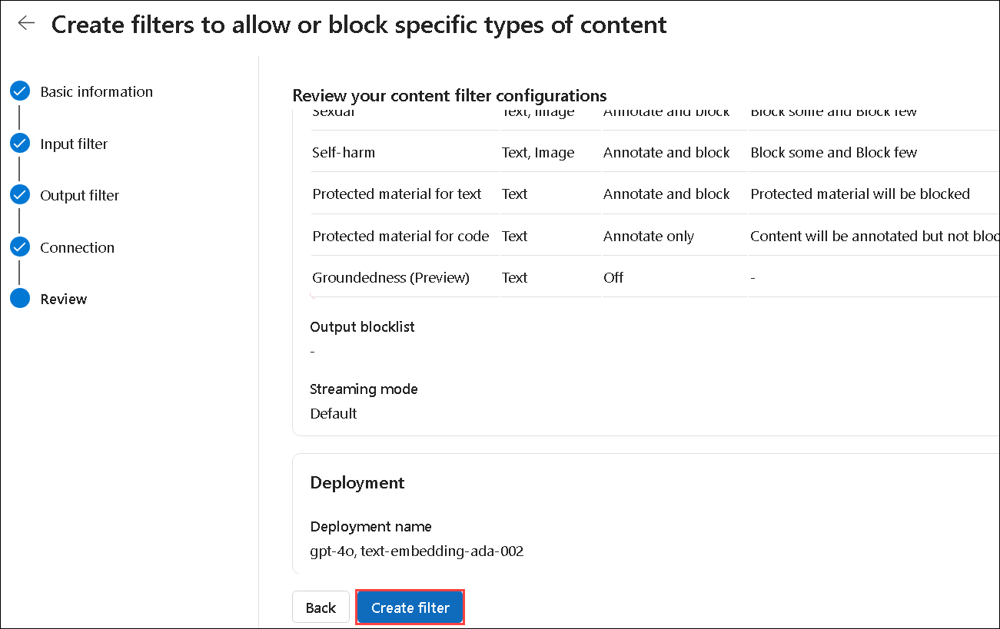
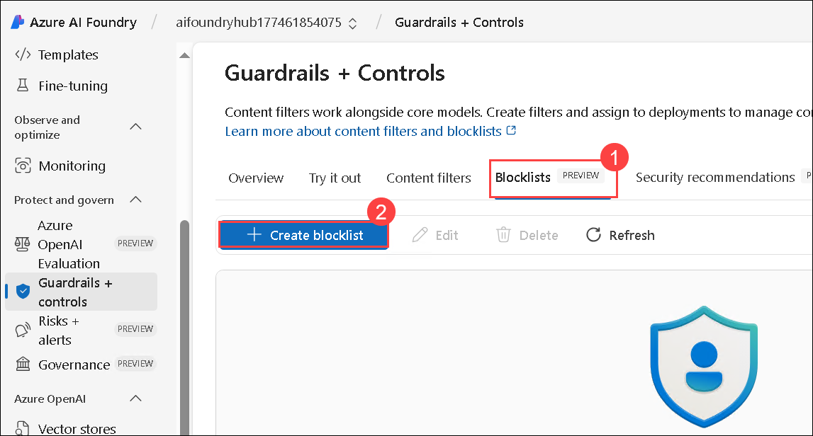

# Exercise 6: Responsible AI: Exploring Content Filters in Azure AI Foundry
### Estimated Duration: 25 Minutes

This hands-on lab introduces content filtering in Azure AI Foundry to help you build safer, more responsible AI applications.
You will learn to apply built-in filters, adjust settings, and create custom rules to block unwanted content—all within Azure AI Foundry Studio.

## Objectives
In this exercise, you will be performing the following tasks:
- Task 1: Adjust Filter Settings
- Task 2: Filter specific words or patterns

## Task 1: Adjust Filter Settings

In this task, you will explore different flow types in Azure AI Foundry by adjusting filter settings to refine search results and improve query accuracy.

1. Navigate to the [Azure AI Foundry](https://ai.azure.com/) portal.

1. Click on **Guardrails + Controls (1)** under **Protect and govern** in the left pane. Navigate to **Content filters (2)** tab and then **+ Create content filter (3)**.

    

1. On the **Create filters to allow or block specific types of content** blade, specify the following configuration options and click on **Next (2)**:
   - **Name**:  **AggressiveContentFilter (1)**

     

1. Leave the visible options to default and click on **Next** twice.

1. On the **Create filters to allow or block specific types of content**, **Deployment (Optional)** blade, select **all 2** of the deployments, and click **Next (2)**.

    

1. If you get a **Replacing existing content filter** warning, click on **Replace (1)**.

    

1. Create one **Create filter**.

    

## Task 2: Filter specific words or patterns

In this task, you will explore different flow types in Azure AI Foundry by filtering specific words or patterns to refine search results and enhance data relevance.

1. Navigate to **Blocklists (Preview) (1)** tab and then **+ Create blocklist (2)**.

    
    
1. On the **Create a blocklist** blade, specify the following configuration options and click on **Create blocklist (3)**:

    - **Name**:  **CustomBlocklist<inject key="Deployment ID" enableCopy="false"></inject> (1)**
    - **Description**: This is a custom blocklist. **(2)**

      

1. Click on **CustomBlocklist<inject key="Deployment ID" enableCopy="false"></inject>** created earlier.

1. Click on **+ Add new term**.

    

1. Enter words **password (1)** and select the type as required (**Exact Match** or **Regex**) then click on **Add term**.

    

1. Click on **+ Add new term** again.   

1. Repeat the step for the following and select the type as required (**Exact Match** or **Regex**):-

    - credentials
    - exploit
    - hack
    - keylogger
    - phishing
    - SSN
    - credit card
    - bank account
    - CVV
    - casino
    - poker
    - betting

      

## Review

In this exercise, we explored **content filtering** in **Azure AI Foundry** to support the development of safer and more responsible AI applications. We applied built-in filters, adjusted content moderation settings, and created custom rules to block unwanted content within Azure AI Foundry Studio. This enhanced our proficiency in implementing ethical and secure AI solutions.

You have successfully completed the below tasks for **content filtering in Azure AI Foundry**:  

- Implemented **Azure AI Content Safety** to ensure responsible AI interactions.  
- Applied **built-in content filters** to block harmful or inappropriate responses.  
- Configured **custom content moderation rules** within **Azure AI Foundry Studio**.  
- Adjusted **content filtering settings** to align with ethical AI guidelines.  

## Go to the next lab by clicking on the navigation.
