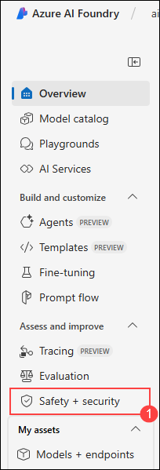
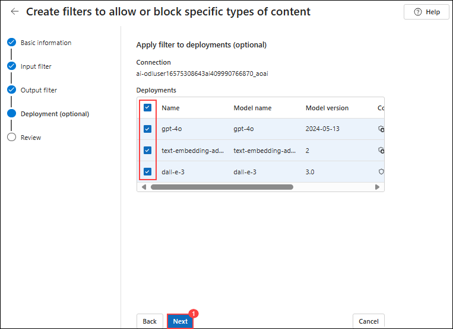

# **Exercise 6**: Responsible AI: Exploring Content Filters in Azure AI Foundry
### Estimated Duration: 60 minutes

In this challenge, you will learn how to enhance the safety and reliability of your AI-powered applications by leveraging content filters and protection mechanisms available in Azure AI Foundry. Azure AI provides powerful tools to help developers create ethical AI solutions by filtering out harmful or inappropriate content from model outputs. You will explore how to work with these filters in the Azure AI Foundry Studio, adjust settings, and even create custom filters to block specific words or phrases.

Content filters are essential in ensuring that your AI models meet your organization's ethical guidelines and regulatory requirements. By the end of this challenge, you will be able to configure filters that align with your application's needs and ensure safer interactions.

## Objectives
In this exercise, you will be performing the following tasks:

## Task 1: Adjust Filter Settings

1. Navigate to [Azure AI Foundry](https://ai.azure.com/) portal.
1. Click on **Safety + security (1)** under **Assess and improve** in the left pane.

    
1. Click on **Content filters (1)** and then followed by **+ Create content filter (2)**
    
1. On the **Create filters to allow or block specific types of content** blade, specify the following configuration options and click on **Next (3)**:
   - **Name**:  **AggressiveContentFilter (1)**
   - **Connection**: select the available **Azure OpenAI (2)** resource

        
1. Leave the visible options to default and click on **Next** twice.
1. On the **Create filters to allow or block specific types of content**, **Deployment (Optional)** blade, select **all 3** of the deployments and click on **Next (1)**.

    
1. If you get **Replacing existing content filter warning**, click on **Replace (1)**.

    
1. Create on **Create filter (1)**.

    

## Task 1: Filter specific words or patterns