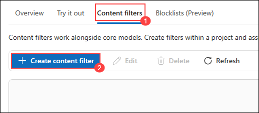
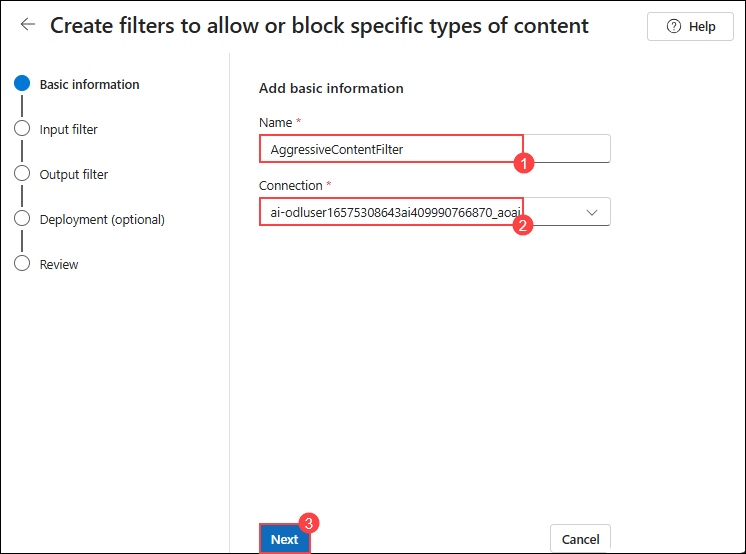
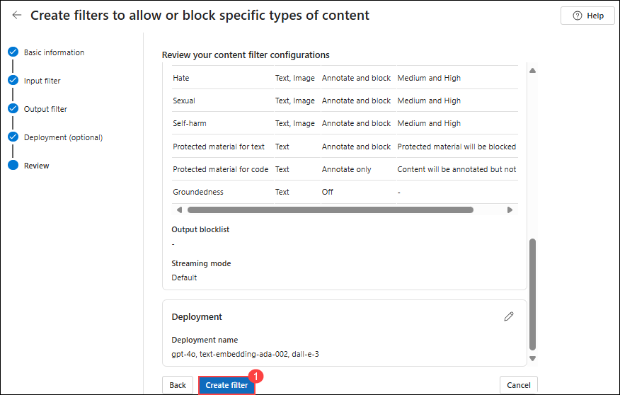
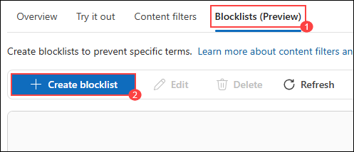
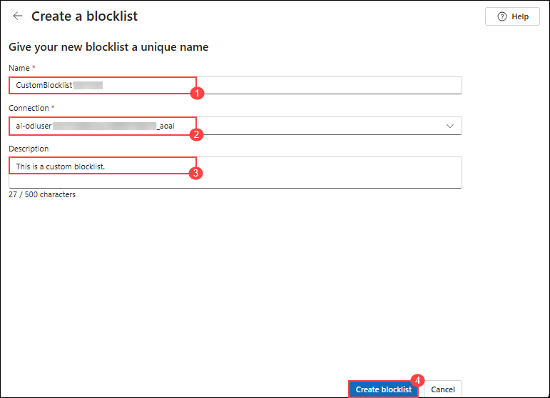

# **Exercise 6**: Responsible AI: Exploring Content Filters in Azure AI Foundry
### Estimated Duration: 25 minutes

This hands-on lab introduces content filtering in Azure AI Foundry to help you build safer, more responsible AI applications.
You'll learn to apply built-in filters, adjust settings, and create custom rules to block unwanted content—all within Azure AI Foundry Studio.

## Objectives
In this exercise, you will be performing the following tasks:
- Task 1: Adjust Filter Settings
- Task 2: Filter specific words or patterns

## Task 1: Adjust Filter Settings

In this task, you will explore different flow types in Azure AI Foundry by adjusting filter settings to refine search results and improve query accuracy.

1. Navigate to [Azure AI Foundry](https://ai.azure.com/) portal.
1. Click on **Safety + security (1)** under **Assess and improve** in the left pane.

    
1. Click on **Content filters (1)** and then followed by **+ Create content filter (2)**.

    
1. On the **Create filters to allow or block specific types of content** blade, specify the following configuration options and click on **Next (3)**:
   - **Name**:  **AggressiveContentFilter (1)**
   - **Connection**: select the available **Azure OpenAI (2)** resource

        
1. Leave the visible options to default and click on **Next** twice.
1. On the **Create filters to allow or block specific types of content**, **Deployment (Optional)** blade, select **all 3** of the deployments and click on **Next (1)**.

    
1. If you get **Replacing existing content filter warning**, click on **Replace (1)**.

    
1. Create on **Create filter (1)**.

    

## Task 2: Filter specific words or patterns

In this task, you will explore different flow types in Azure AI Foundry by filtering specific words or patterns to refine search results and enhance data relevance.

1. Navigate to [Azure AI Foundry](https://ai.azure.com/) portal.
1. Click on **Safety + security (1)** under **Assess and improve** in the left pane.

    
1. Click on **Blocklists (Preview) (1)** and then followed by **+ Create blocklist (2)**.

    
1. On the **Create a blocklist** blade, specify the following configuration options and click on **Create blocklist (4)**:
   - **Name**:  **CustomBlocklist<inject key="Deployment ID" enableCopy="false"></inject> (1)**
   - **Connection**: select the available **Azure OpenAI (2)** resource
   - **Description**: This is a custom blocklist. (3)

        
1. Click on the **CustomBlocklist<inject key="Deployment ID" enableCopy="false"></inject>** you created just now.
1. Enter words like the following and select the type as required (**Exact Match** or **Regex**) :-
    - password
    - credentials
    - exploit
    - hack
    - keylogger
    - phishing
    - SSN
    - credit card
    - bank account
    - CVV
    - casino
    - poker
    - betting
1. Click on **Add term**.

## Summary

In this exercise, we explored **content filtering** in **Azure AI Foundry** to support the development of safer and more responsible AI applications. We applied built-in filters, adjusted content moderation settings, and created custom rules to block unwanted content within Azure AI Foundry Studio. This enhanced our proficiency in implementing ethical and secure AI solutions.