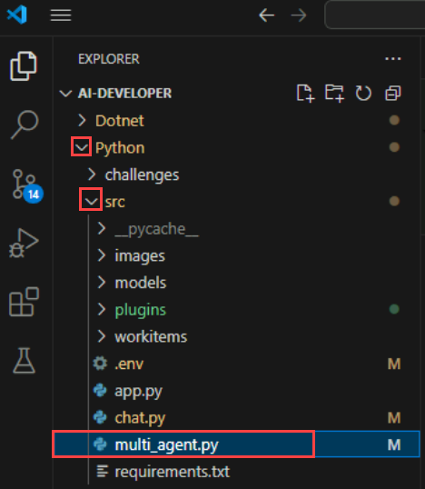
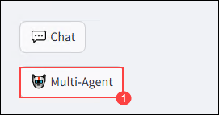
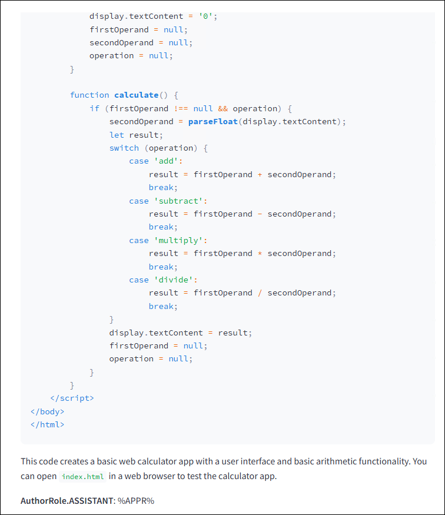
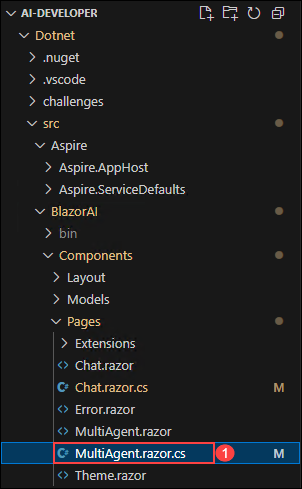
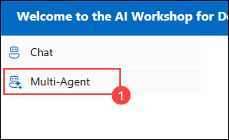
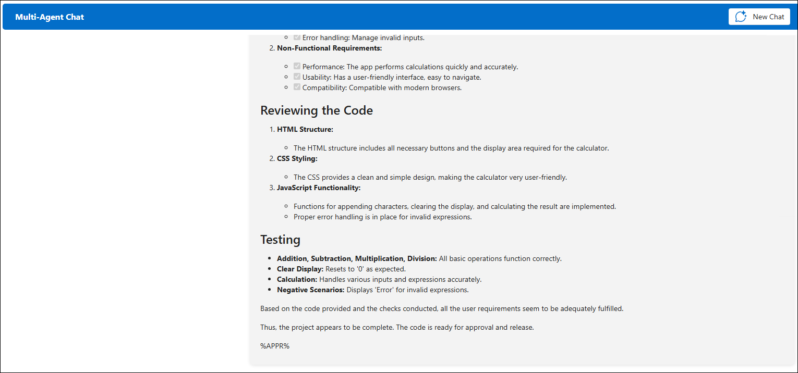

# **Exercise 8**: Multi-Agent Systems

### Estimated Duration: 30 Minutes

This hands-on lab introduces **multi-agent system development**, where a user request is processed by multiple agents, each with a distinct **persona and responsibility**. Designed for those new to **AI-driven automation**, the lab guides you through integrating agents that collaborate to generate a well-rounded response. Whether handling specialized tasks or combining expertise, this system ensures comprehensive context-aware outputs. By the end of this lab, you will understand how to **orchestrate multi-agent interactions** to enhance AI-driven decision-making and user experiences.

## Objectives
In this exercise, you will be performing the following task:
- Task 1: Create a Multi-agent chat system

---

## Task 1: Create a Multi-agent chat system

In this task, you will explore different flow types in Azure AI Foundry by creating a Multi-Agent Chat System to enable collaborative AI interactions.

<details>
<summary><strong>Python</strong></summary>

1. Navigate to the `Python>src` directory and open the **multi_agent.py** file.

    

2. Remove the existing code and replace it with the code from the following URL:
    ```
    https://raw.githubusercontent.com/CloudLabsAI-Azure/ai-developer/refs/heads/prod/CodeBase/python/lab-08.py
    ```

3. Save the file.

4. Right-click on `Python>src` in the left pane and select **Open in Integrated Terminal**.

    

5. Use the following command to run the app:
    ```
    streamlit run app.py
    ```

6. ✅ **Important Step:**  
   Keep the terminal window open and running after starting the application. This is required to serve the interface and handle user input.

7. If the app does not open automatically in your browser, go to:
    ```
    http://localhost:8501
    ```

8. Select **Multi-Agent** from the left-hand side pane.

    

9. Submit the following prompt and observe the AI’s response:
    ```
    Build a Calculator app.
    ```

10. You will receive a response similar to the one shown below:

    

</details>

---

<details>
<summary><strong>C Sharp (C#)</strong></summary>

1. Navigate to the `Dotnet>src>BlazorAI>Components>Pages` directory and open the **MultiAgent.razor.cs** file.

    

2. Remove the existing code and replace it with the code from the following URL:
    ```
    https://raw.githubusercontent.com/CloudLabsAI-Azure/ai-developer/refs/heads/prod/CodeBase/c%23/lab-08.cs
    ```

3. Save the file.

4. Right-click on `Dotnet>src>Aspire>Aspire.AppHost` in the left pane and select **Open in Integrated Terminal**.

    

5. Run the app using:
    ```
    dotnet run
    ```

6. ✅ **Important Step:**  
   Keep the terminal window open and active. The application depends on the running process to host the service and UI.

7. Open a new browser tab and go to:
    ```
    https://localhost:7118/
    ```

    > **Note:** If you see a security warning, refresh the page or re-open the link to proceed.

8. Select **Multi-Agent** from the left-hand side pane.

    

9. Submit the following prompt and observe the AI’s response:
    ```
    Build a Calculator app.
    ```

10. You will receive a response similar to the one shown below:

    

</details>

---

## Review

In this exercise, we integrated a **multi-agent system** into an AI application to process user requests through multiple specialized agents. We explored how each agent, with its own **persona and responsibility**, contributed expertise to generate a comprehensive response. This enhanced our proficiency in **orchestrating multi-agent interactions** to create intelligent, context-aware AI solutions.

You have successfully completed the following tasks for **multi-agent system development**:  

- Designed a **multi-agent system** to process user requests through specialized agents.  
- Assigned **distinct personas and responsibilities** to each agent for task-specific expertise.  
- Integrated **agents’ responses** into a unified, context-aware output.  
- Explored **AI-driven decision-making** by coordinating multiple agents efficiently.

---

##  Happy Learning!!
